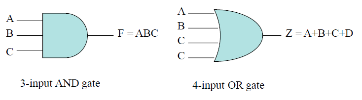

# VE270 Lecture 1

>   Digitization: From **Analog** to **Digital**.

## Signed Binary Numbers

### Representation of Negative Numbers

#### 1. Sign and Magnitude

**MSB**, or the left most digit is the signed bit, $0 \rightarrow $ positive, $1 \rightarrow $ negative.

#### 2. 1's complement representation of $-N$

Negation of every bit of $N$.

$(3)_{10} = (0011)_2$, then $(-3)_{10} = (1100)_2$.

#### 3. 2's complement representation of $-N$

Negation of every bit of $N$, then plus $1$.

$(3)_{10} = (0011)_2$, then $(-3)_{10} = (1100)_2 + (1)_2 = (1101)_2$.

## Signed 2's complement Number 

If there are $n$ digits, the range is from $-2^{n-1}$ to $2^{n-1}-1$.

### Overflow

>   If an **$n$-bit** 2’s complement number is greater than $2^{n-1}-1$ or less than $-2^{n-1}$, we say there is an overflow.

-   $a, b$ with sign bits same but result's sign bit is not the same **is overflow**.
-   $a,b$ with different sign bit **can't overflow**.

### Trick

-   Addition with **signed 2's complement number** should only in these situations:

    -   $a, b$ are all positive.
    -   $a,b$ are positive and negative.

    So if $a, b$ are all negative **will certainly cause a overflow**.

# VE270 Lecture 2

## CMOS Transistor

-   <u>nMOS</u>: 
-   <u>pMOS</u>: 

## AND Logic

$Z = X \cdot Y$ and $X, Y, Z$ are all **variables** with $\cdot$ as **AND operator**.

 

## OR Logic

$Z = X + Y$ and $Z = 1$ if either $X = 1$ or $Y=1$, or both; with $+$ as **OR operator**.

 

## NOT Logic

$Z = X'$ or $Z = \overline{X}$ means $Z = 1- X$ with $Z$ and $X$ either 0 or 1.

 

## Logic Gates Convert

(We can omit **NOT**'s triangle with only a little circle on the diagram.)

## Priority of Logic Operations

**NOT > AND > OR**

## From Logic Equation to Logic Circuit

## Timing Diagram

Show the response to change on a signal in voltage levels with time.

## Gates with Multiple Inputs

## More Gates

# VE270 Lecture 3

>   Boolean Algebra & Optimization

## Boolean Algebra Terminology

Example: $F(a,b,c) = a'bc+abc'+ab+c$

-   **Variable**: Represents a value (0, 1)

    -   Three variables: $a, b, c$

-   **Literal**: Appearance of a variable, in true or complemented form

    (true form: $a$; complemented form: $a'$)

    -   Nine literals: $a',b,c,a,b,c',a,b,c$

-   **Product term**: AND of literals

    -   Four product terms: $a'bc$, $abc'$, $ab$, $c$ ($c = c \cdot 1$)

-   **Sum term**: OR of literals

    -   No sum terms

        (in $F=(a+b+c)\cdot d$, $a+b+c$ is sum term)

-   **Sum of products**: Equation written as OR of product terms only

    -   $F(a,b,c) = a'bc+abc'+ab+c$ is a sum of product form
    -   $F(a,b,c,d) = (a+b)\cdot c + d$ is not

## Basic Theorems of Boolean Algebra

###  Theorem1

$x+0=x$ and $x \cdot 0 = 0$.

$x$ OR $0$ is $x$, $x$ AND $0$ is $0$.

### Theorem2

$x+x'=1$ and $x \cdot x' = 0$.

$x$ OR $\neg x$ is $1$, $x$ AND $\neg x$ is $0$.

### Theorem3

$x+x=x$ and $x \cdot x = x$.

$x$ OR $x$ is only $x$, since $x = x$; $x$ AND $x$ is only $x$, since $x = x$.

### Theorem4

$x+1=1$ and $x \cdot 1 = x$.

$x$ OR $1$ is $1$, $x$ AND $1$ is $x$.

### Involution

$(x')'=x$, since $\neg (\neg x) = x$.

### Commutative

$x+y=y+x$ and $x \cdot y = y \cdot x$.

$x$ OR $y$ is $y$ OR $x$, $x$ AND $y$ is $y$ AND $x$.

### Associative

$x + (y+z) = (x+y)+z$ and $x \cdot (y \cdot z) = (x \cdot y) \cdot z$.

$x$ OR $(y$ OR $z)$ = $x$ OR $y$ OR $z$ = ($x$ OR $y$) OR $z$,

$x$ AND ($y$ AND $z$) = ($x$ AND $y$) AND $z$ = $x$ AND $y$ AND $z$.

### Distributive

$x\cdot (y+z) = x\cdot y+x\cdot z$ and $x + y\cdot z = (x+y) \cdot (x+z)$.

$x \cdot (y + z) = x \cdot y + x \cdot z$,

$x + y \cdot z= x \cdot 1 + y \cdot z = x \cdot (1+y) + y \cdot z\\= x + x \cdot y + y \cdot z= x \cdot x + (x+z) \cdot y\\= x \cdot (x+ z) + (x+z) \cdot y= (x+y) \cdot (x + z)$

### Absorption

$x + x\cdot y = x$ and $x \cdot (x + y) = x$.

$x + x \cdot y = x \cdot (1 + y') + x \cdot y = x + x \cdot (y + y') = x + x = x$,

$x \cdot (x + y) = x + x \cdot y = x$.

### Theorem5

$x \cdot y + x \cdot y' = x$ and $(x + y) \cdot (x + y') = x$.

$x \cdot y + x \cdot y' = x \cdot (y + y') = x$,

$(x + y) \cdot (x + y') = x + y \cdot y' + x \cdot y + x \cdot y' = x$.

### Theorem6

$x + x' \cdot y = x + y$ and $x \cdot (x' + y) = x \cdot y$.

$x + x' \cdot y = x \cdot (1 + y) + x' \cdot y = x + (x' + x) \cdot y = x + y$,

$x \cdot (x' + y) = x \cdot y + 0 = x \cdot y$.

### Application of Basic Theorems

-   $(a+b)\cdot (c + b) \cdot (d' + b) \cdot (a \cdot c \cdot d' + e)\\= (a \cdot c \cdot d' + b) \cdot (a \cdot c \cdot d' + e)\\= (a \cdot c \cdot d' + b\cdot e)$
-   $w \cdot x' \cdot y' + w \cdot x \cdot z' + w\cdot x' \cdot y \cdot z'\\=w \cdot x' \cdot (y' + y \cdot z') + w \cdot x \cdot z'\\=w \cdot x' \cdot (y' + z') + w \cdot x \cdot z'\\=w \cdot z' + w \cdot x' \cdot y'$

## De Morgan's Law

$(x+y)' = x' \cdot y'$

$(x \cdot y)' = x'+y'$

## Consensus Theorem

$x \cdot y + x' \cdot z + y \cdot z = x \cdot y + x' \cdot z$

$x \cdot y + x' \cdot z + y \cdot z\\=x \cdot y + x' \cdot z + (x + x') \cdot y \cdot z\\=x \cdot y + x' \cdot z + x\cdot y \cdot z + x'\cdot y \cdot z\\=x \cdot y \cdot (1 + z) + x' \cdot z \cdot (1 + y)\\=x \cdot y + x' \cdot z$

##  XOR Properties

###  Theorem1

$x \oplus 0 = x$, $x \oplus 1 = x'$

### Theorem2

$x \oplus x = 0$, $x \oplus x' = 1$

### Theorem3

$x \oplus y' = x' \oplus y = (x \oplus y)'$

### Commutative

$x \oplus y = y \oplus x$

### Associative

$(x \oplus y) \oplus z = x \oplus (y \oplus z) = x \oplus y \oplus z$

## Boolean Representation: Minterm and Maxterm

### Minterm

A product of n literals in which each literal appears exactly once in either true or complemented form, but not both.

Represented by $m_i$.

### Maxterm

A sum of n literals in which each literal appears exactly once in either true or complemented form, but not both.

Represented by $M_i$.

### Subscription Example

### From Truth Table to Minterm Expression

-   A Boolean Equation can be derived from a truth table and expressed as a sum-of-minterms (standard-sum-of-products).
-   Each minterm corresponds to a $1$ in the truth table in the sum-of-minterms expression.
-   $F = x'y'z + x'yz+xy'z+xy'z = m_1+m_3+m_4+m_5 = \sum m(1,3,4,5)$

### Minterms and Maxterms Conversion

#### Complement of Minterm is corresponding Maxterm

$m_i = M_i$

e.g.: $m_0 = x'y'z', m_0' = (x'y'z')' = x + y+ z = M_0$

#### Conversion between Standard Forms

The term numbers **missing from one form** will be the term number **used in the other form**.

e.g.: if all the terms are indexed by 0 ~ 7, then $F = \sum m(1,2,4,7) = \prod M(0, 3,5,6)$.

another example: 

### Incompletely Specified Functions

In a circuit, some input conditions may never happen, then the output is not completely specified.

The corresponding output is set as `"x"`, meaning **don't care**.

The **don't care** output could be either 0 or 1.

$F = \sum m(1,3,4) + \sum d(2,5)$: 

### Simplified Forms

The minterm and maxterm forms can be further simplified:

-   contain less number of terms.
-   have less literals.