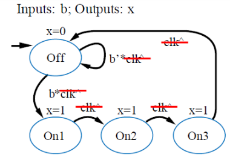
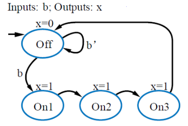
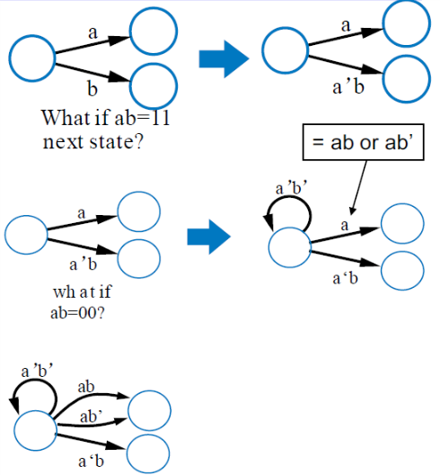

# VE270 Lecture 10 FSM

## Synchronous FSM

FSM behaviors synchronized to the active edge of clock.

| FSM shows clock change                   | Synchronous FSM                          |
| ---------------------------------------- | ---------------------------------------- |
|  |  |

## Common State Transition Property

-   Only one condition should be true, among all transitions leaving a state
-   One condition must be true, for any input combination
-   All conditions must be considered when leaving a state

## Standard FSM Architecture

FSM can be used as a controller.

Apply state register and combinational logic, this is a controller.

## FSM Design Steps

-   Capture FSM, draw the FSM plot out

-   Create Architecture

    State-Register bit width

    input output specify

    present state signals

    next state signals

-   Encode the states

-   Create state table for input and output, present state and next state

-   Implement with combinational logic (K-Map)

