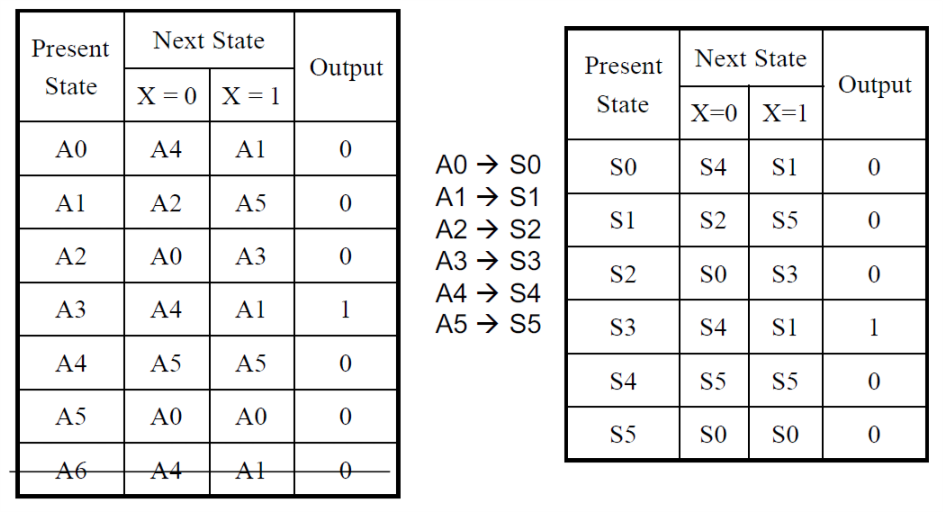

# VE270 Lecture 11 FSM Optimizations

## Optimization by State Reduction

## Moore and Mealy FSMs

Check FSM circuit:

-   **Next state logic** is defined by the **current state logic** and **FSM inputs**.
-   Output logic:
    -   **Moore logic FSM**: it depends on **present state** only.
    -   **Mealy logic FSM**: it depends on **present state** and **FSM inputs**.

| Moore FSM                                | Mealy FSM                                |
| ---------------------------------------- | ---------------------------------------- |
|  |  |

## Problem Example

### Mealy FSM Design

 it is the initial diagram, and we can use a state reduction table.

Two states are equivalent iff both next states and outputs are identical 

and we get new one: 

After applying state register, we implement it into a circuit.

### Moore FSM Design

 is the initial diagram

 reduces the states

 and here is the new diagram

### Moore vs Mealy

-   Output
    -   Moore: Depends on current state
    -   Mealy: Depends on current state and inputs
-   State Diagram
    -   Moore: More states $\to$ possibly bigger circuit
    -   Mealy: Less states $\to$ possibly less number of flip-flops
-   Speed of output response to the inputs
    -   Moore: as long as one clock cycle delay
    -   Mealy: quick, as soon as input changes
-   Timing issue
    -   Moore: synchronous, more stable
    -   Mealy: asynchronous (also based on inputs), may cause serious problem

## Combined Mealy and Moore

## FSM Reverse Engineering

Given a circuit of FSM, we should find the behavior

-   Mealy or Moore
-   State number
-   Logic for next state
-   State table
-   State diagram

## Implication Table State Reduction

Use implication tables to simplify the FSM.