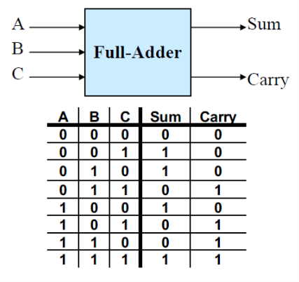
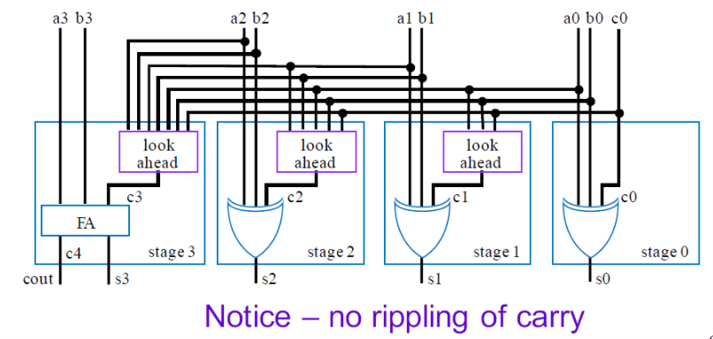
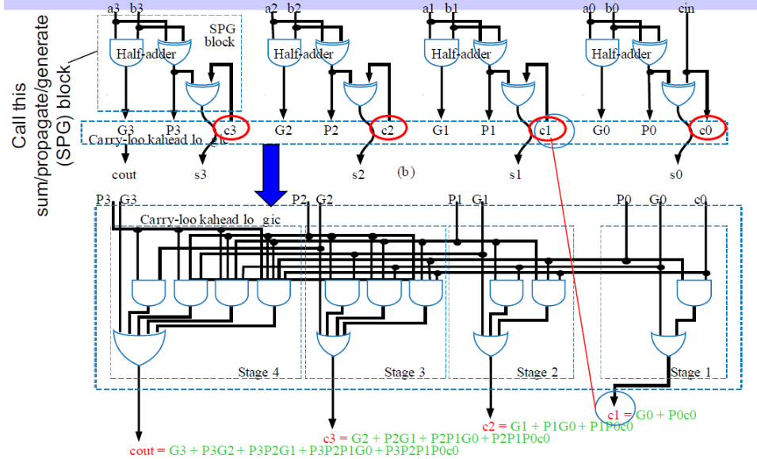

# VE270 Lecture 12 Arithmetic Components

## Carry Look-ahead Adder

Check the Carry-Ripple Adder, it is created with full adders.

For 4-bit adder, we add two 4-bit numbers and generate a 5-bit number (4-bit sum and 1-bit carry).

## Faster Adder

Use two-level combinational logic design process.

-   pro: fast

    2 gate level delays

-   con: large

    -   9 inputs and 5 outputs.
    -   Truth table would have $2^{4+4+1} = 512$ rows

## Full Adder

sum is $\sum m(1,2,4,7) = A\oplus B\oplus C $, carry is $\sum m(3,5,6,7) =AB+AC+BC =  (A \oplus B)C + AB$

## Faster Adder - Intuitive Attempt at "Look ahead"

Then we produce carries directly and recursively: $c_{n+1} = a_nb_n + a_nc_n+b_nc_n$

Two layer SOP logic.

## Better Form of Look Ahead

Since we get the $\text{Carry} = ab + (a\oplus b) c$ then we define $\text{Propagate } P = a \oplus b$ and $\text{Generate } G = ab$.

Then $\text{Cout} = G + Pc$, $c_{n+1} = G_{n} + P_nc_n$

So only 4 gate level delay, 2 from SPG block and 2 from look ahead block.

## Cascading Adder

