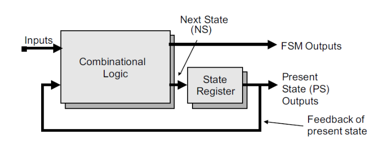
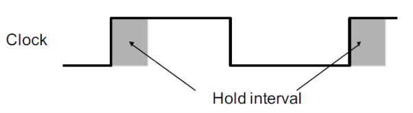
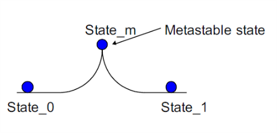
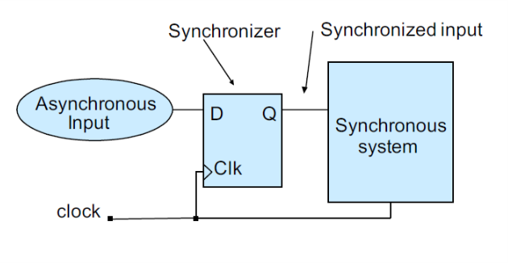

# VE270 Lecture 14 Timing Issues

## Clocking Methodology for FSM

Since the Combinational Logic changes inputs into next states in just between clock edges, the clock cycle should be:

-   long enough to allow combination logic complete computation
-   short enough to ensure acceptable performance and to capture small changes on external inputs.

So the hold time is used to minimum the time for the data change to be stable at the triggering edge.

Hold-time violation is caused by short paths that allows a signal to propagate from a source flip-flop to a destination flip-flop and change the data, change the data generated in previous clock cycle before the destination flip-flop has registered its output.

So we use buffers and use different flip-flops.

## Meta-stability and Asynchronous Inputs

If the setup or hold time of an edge-triggered flip-flop is violated, the flip-flop may enter a metastable state.

So it may eventually settle down to one of the two states, but we can't predict.

So for a full synchronous system, an unpredictable arrival of asynchronous input may cause system failure.

Asynchronous fan-out path delay may cause some input transition to be "caught" by some devices and "missed" by others.

So we try to ensure all inputs are synchronous, reset and set can be exceptions.

## Synchronizer

