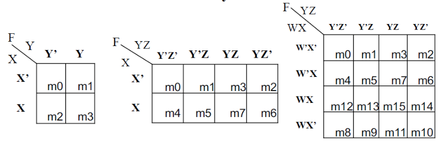

# VE270 Lecture 4 Logic Optimization

## Simplification and Optimization

Care for two things:

-   Delay (Gate delay)
-   Size (transistors)

For quick estimation, assume:

-   every gate need a "1 **gate-delay**"
-   every **gate input** require **2 transistors**
-   ignore **inverters** for simplicity

## Two-level Logic Optimization

We use **algebraic method**.

**Goal**: we change circuit into two levels (AND-OR network) with minimum transistors.

Sum-of-Products yields two levels. (e.g. $F=abc+a'b'c'$)

## Multi-level Logic Optimization

**tradeoff** exists, we improve some, worsen some.

## Critical Path

The **longest delay path** for an input to output in the circuit.

**Optimization**:

-   Reduce overall delay by shortening length of **critical path**
-   Reduce the size by using **multi-level** on non-critical path
    -   but may make **non-critical path** become **critical path**.

## Power Optimization

CMOS power consuming: $P = K\cdot CV^2\cdot f$

-   $K$ constant
-   $C$ capacitance of wire
-   $V$ voltage
-   $f$ switching frequency

## Low-Power Gate on Non-critical Path

-   Fast/high-power
-   Slow/low-power

So use slow/low-power gates on non-critical path reduces power without increase delay.

## K-Map Logic Optimization

### Simplifying: Grouping and Canceling

-   Group is in shape of rectangle or square
-   Group the adjacent 1’s until all the 1’s are grouped
-   The number of 1’s in the group should be $2^N, N = 0, 1, 2, \cdots$
-   No zeros in group

-   Group as much adjacent 1's as possible

    

-   Edges wrap around

    

## Group Patterns

-   If a letter with both primed and unprimed form happen in a group, the letter canceled.
-   The simplified result will be a sum-of-product form, the number of product terms is decided by the number of the groups.
-   A group of all cells gives logic 1.
-   A group of $2^n$ cells gives a term of $N - n$ literals. $2^N$ is total cell number.

## Prime Implicants

**Implicant**: a product term

**Prime Implicant (PI)**: a group that cannot entirely contained by another implicant.

## Essential Prime Implicants

**Essential Prime Implicant**: if the PI contain a cell can **ONLY** covered by this PI.

## Alternate Method: Product-of-Sum Simplification

-   Redraw K-map for $F'$ (switching 1's and 0's)
-   then with DeMorgan's Law to change the $F'$ sum-of-product into product-of-sum

## Simplify any standard sum-of-product form

### Method 1: fill out table directly

### Method 2: convert all forms into sum-of-minterm

$F = A'C+A'BD+AB'C+BCD=\sum m(2,3,5,6,7,10,11,15)$

Then put into K-map for simplification.

## Don't Care Conditions

Construct Essential Prime Implicants with "Don't Care Conditions" if needed.

Then we apply same K-map simplification method.

## Seven-Segment Display

Each LED has one anode (+) and one cathode (-).

Anode high-level-voltage, Cathode low-level-voltage, LED light on.

On Nexys2, we have seven segment display with common anode.

