# VE270 Lecture 5 Combination Circuit

## Combinational Circuit Definition

Digital Circuit whose output depends **only on the present combination of its inputs**.

-   Output changes only when input changes
-   Output changes once input changes

## Sequential Circuit Definition

Digital Circuit whose output depends on:

-   present input values
-   history of input and output values
-   have feedbacks on outputs

## Design of Combinational Circuits

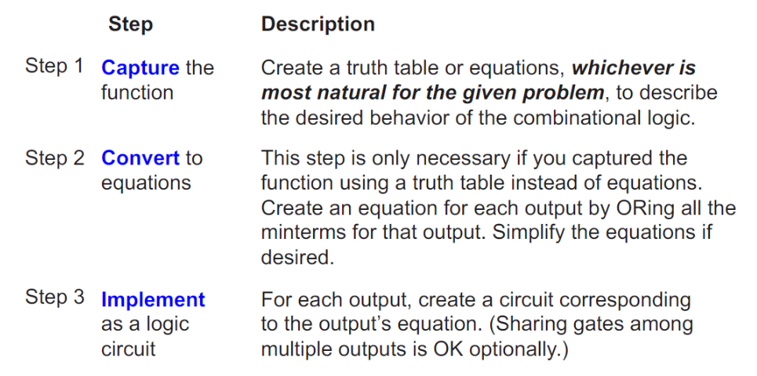

## Example: Counting 1's

>   Output in binary the number of 1 on three inputs
>
>   ​001 :arrow_right: 01, 110 :arrow_right: 10, 000 :arrow_right: 00

-   Step1: Capture the function

    truth table / equation?

    truth table since it is small and straightforward.

    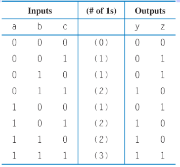

-   Step2: Convert to equation

    $y = a'bc+ab'c+abc'+abc$ and $z=a'b'c+a'bc'+ab'c'+abc$

-   Step3: Implement the gate circuit

    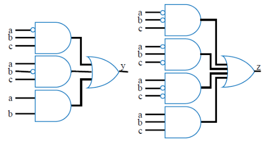

## Example: Three 1s Detector

>   Detect three consecutive 1s in 8-bit input
>
>   ​00011100 $\rightarrow$ 1, 10101011 $\rightarrow$ 0

-   Step1: Capture function

    truth table / equation?

    equation is appropriate, since truth table is too huge $2^8$

-   Step2: Convert to equation

    $y = abc + bcd + cde+def+efg+fgh$

-   Step3: Implement as gate circuit

    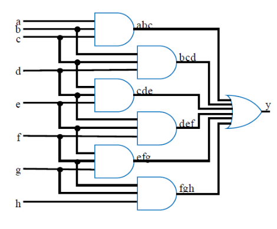

## Multiplexor (Mux)

Routes of $N$ data inputs to $1$ output, based on binary value of select inputs

$2$ inputs $\to$ $1$ select bit

$4$ inputs $\to 2$ select bits

$2^n$ inputs $\to n$ select bits

### 2x1 Mux

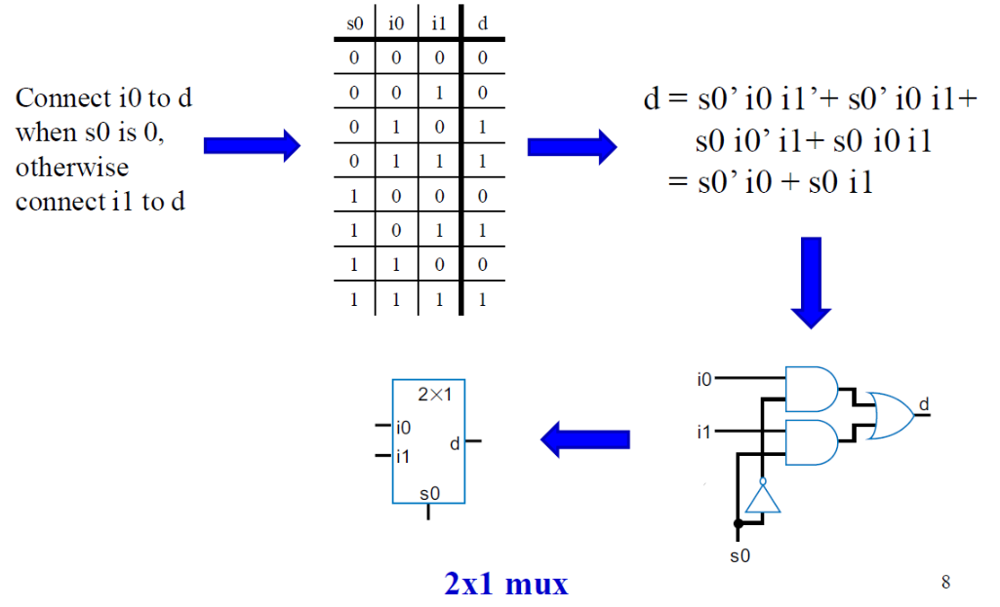

### 4x1 Mux

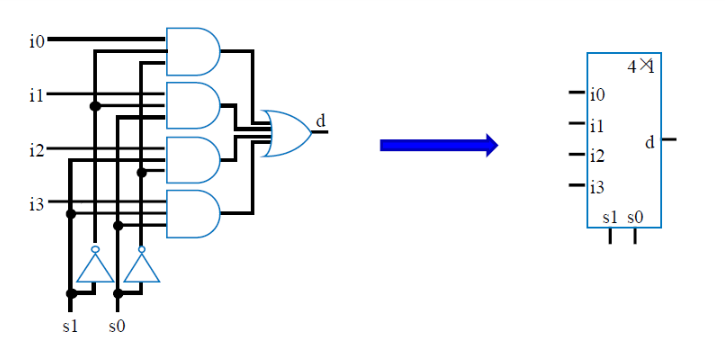

### 4-bit 2x1 Mux

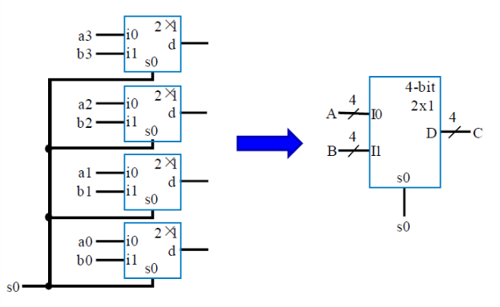

Two 4-bit input A(a3 a2 a1 a0) and B(b3 b2 b2 b0), select A or B.

Width of input channel may be $2^n$.

## Half Adder

Addition of two single bits A B.

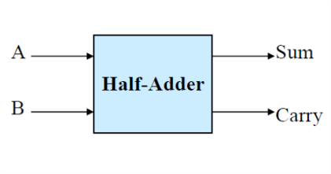

According to the truth table, then with XOR simplify, we get:

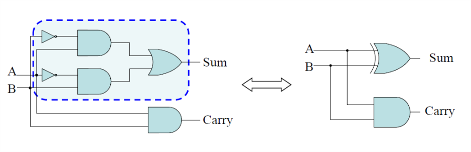

## Full Adder

Addition of three single bits A B C.

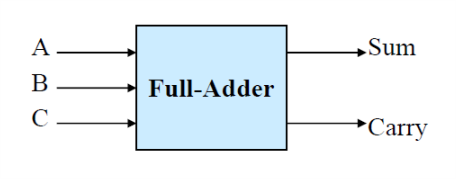

Then with truth table, XOR simplify, Half-Adder simplify:

## Carry-Ripple Adder

2 4-bit input added and generate a 5-bit (4-bit and a carry) output:

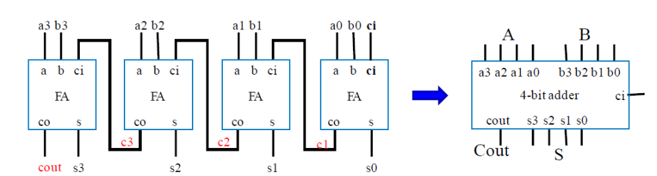

## 2's Complement Subtractor

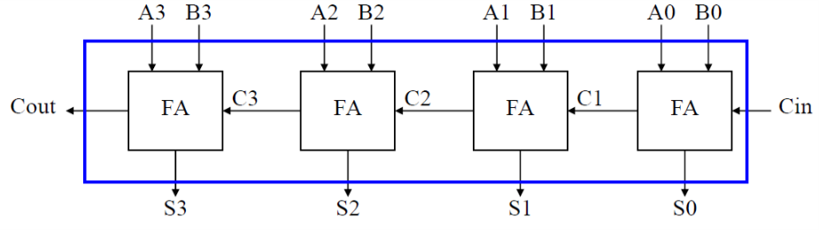

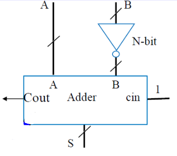

## 4-Bit 2's Complement Subtractor and Adder

| Subtractor                               | Adder                                    |
| ---------------------------------------- | ---------------------------------------- |
| 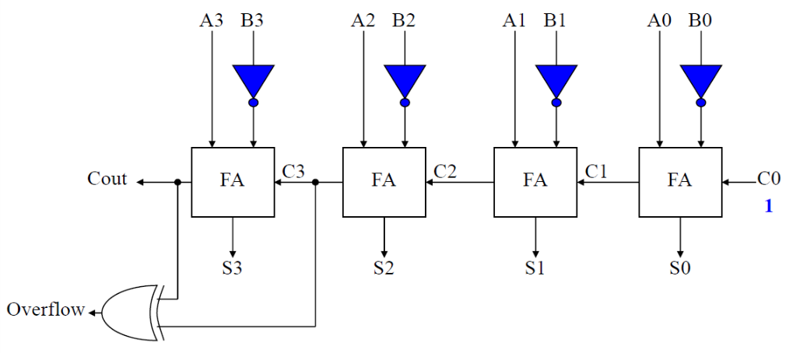 | 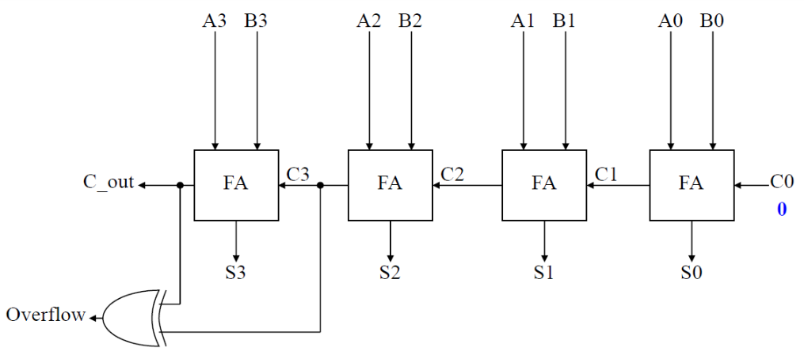 |

(notice: 4-Bit 2's complement value range from $-2^3$ to $2^3-1$, first three bit for value, last one for indicator.)

## Arithmetic-Logic Unit: ALU

Component that can perform **any of various arithmetic operations** (add, subtract ...) based on **control inputs**.

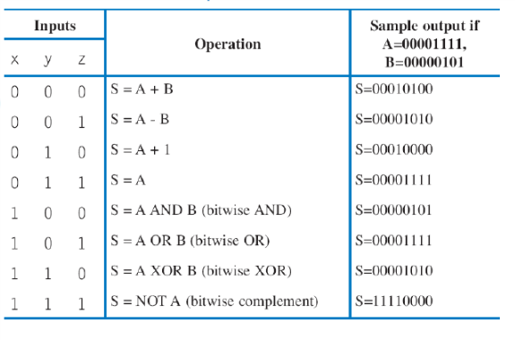

## Encoder

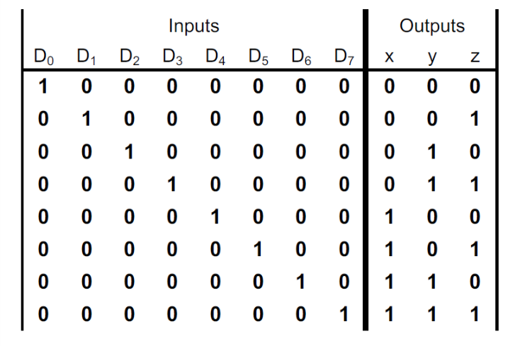

## Decoder

for 3 bit input with 8 outputs, we have the truth table:

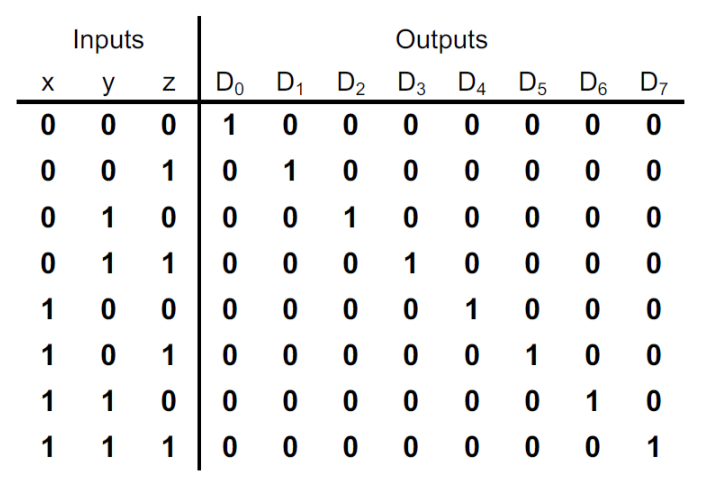

actually the circuit is a **min-term generator**:

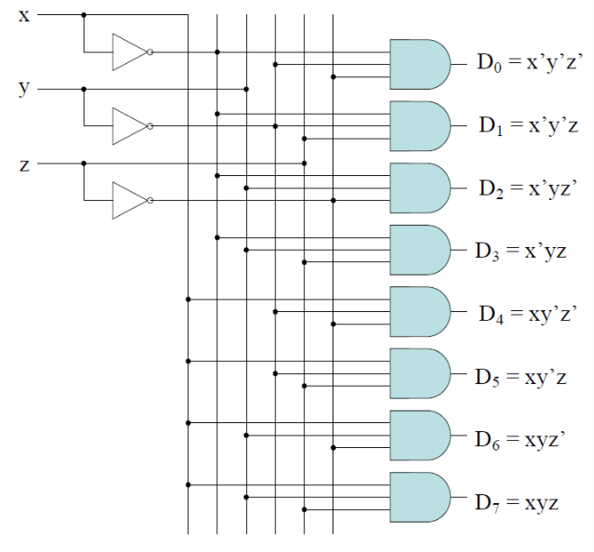

## Buffer and Tri-state Buffer

### Buffer Definition

a directional transmission logic device 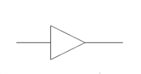

-   like NOT gate with no inverting binary value.
-   insert delay (gate delay)
-   amplifying the driving capability of a signal
-   protect input from output

### Tri-state Buffer Definition

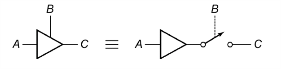

A three state (Tri-state) buffer can have three different output values, controlled by an enable bit:

-   0 when B = 1, A = 0
-   1 when B = 1, A = 1
-   Z (high impedance, no voltage) when B = 0, A = x