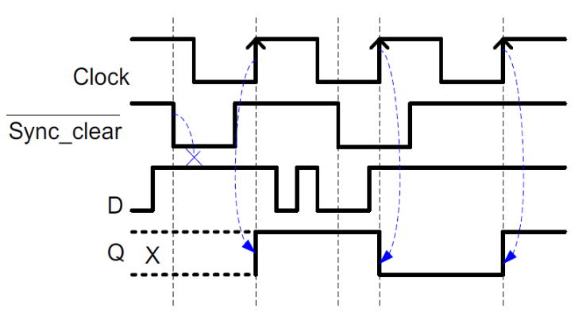

# VE270 Lecture 6 Latches and Flip Flops

## Reality of Combinational Circuit: Non-Ideal Gate Behavior: Delay

## Bit Storage

### An Unsuccessful Attempt

So due to the feedback on combinational circuit, the output (real, not ideal) is decided by

-   Present Inputs
-   Past Input Sequence
-   Past Output Sequence

### SR Latch: Second Attempt at Bit Storage

Then we can implement a circuit:

But what will happen **if S=1 and R=1 simultaneously**.

### Representation of SR Latch

When discussing about latches and flip-flops, we use

-   **present state** to represent **current value of Q output**
-   **next state** to represent **new value of Q output** responding to **current inputs** and **feedback of current output**

So $Q^+=S+R'Q$.

### Alternative Implementation of SR Latch

### Gated SR Latch

### Solution for SR Latch Restriction: Gated D Latch

A solution to the unstable state problem caused by $S=R=1$ in $SR$ Latch

#### Gated D Latch - Transparent Latch

properties:

-   temporary storage of a bit
-   The binary information at the data input of the D latch is **copied to** the Q output when the control input G is high (or enabled)
-   The output Q follows changes on the data input D as long as the control input G is enabled, so called a **transparent latch**.

### Control Input - Clock Signal

### Problem with Level-Sensitive D Latch

So if the time length of Clk is short, the signal will go through fewer latches.

It is hard to control storage elements.

### Rising-Edge Triggered D Flip Flop

with the characteristic equation: $Q^+=D$ at active clock edges

#### Properties of Rising-Edge triggered D Flip Flop

-   The output changes only at the **rising edges of the clock signal**.
-   The output Q gives the value of input D at the time point of rising edge of clock.

### D Flip-Flop Symbols

### Application of D Flip-Flop

Check back to D Latch problem, then it ignore the $Clk = 1$ time length, just focus on rising edge.

### Flip Flop & Latch

-   Flip Flop
    -   **edge-sensitive**, input only focus on active edges (rising/falling)
    -   behaviors are **synchronous** to the clock signal (synchronous is because it has clock signal)
-   Latch
    -   **level-sensitive**, input matters whenever control has active level (high/low)
    -   behaviors are **asynchronous** to the clock signal (asynchronous is because it doesn't have clock signal)

### A D Flip-Flop Implemented Flight-Attendant Call Button

### Rising Edge-triggered JK Flip Flop

### Rising Edge-triggered T Flip Flop

### Basic Register

Multiple Flip-Flops sharing same clock signal.

Then we can set register:

### Control Input for Flip Flops

-   Asynchronous: control signals do not depend on clock signal
-   Synchronous: control signals depend on the clock signal
-   Active low: it controls when it is low
-   Active high: it controls when it is high

#### Asynchronous Control Implement

D Flip Flop with active low asynchronous Clear

#### Synchronous Control Implement

Synchronous clear: control signal depends on the active edge (either rising or falling) of the clock signal.

D Flip Flop with active low synchronous Clear.

