# VE270 Lecture 8 Counter

## Asynchronous Binary Counter

### T-Flip-Flops implementation

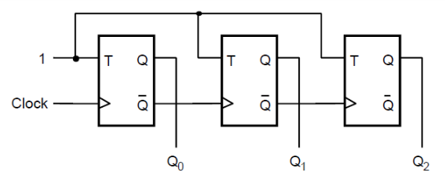

### D-Flip-Flops implementation

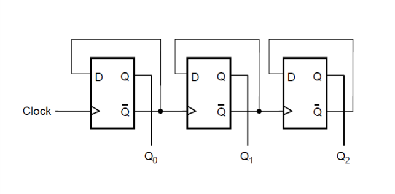

### Problem: Delays

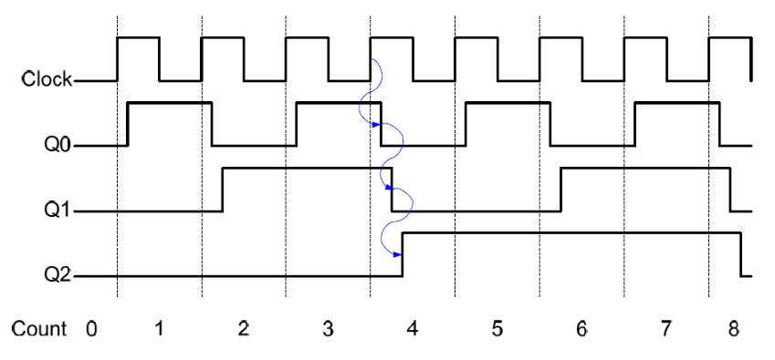

## Synchronous Binary Counter

### Design (With D-Flip-Flop)

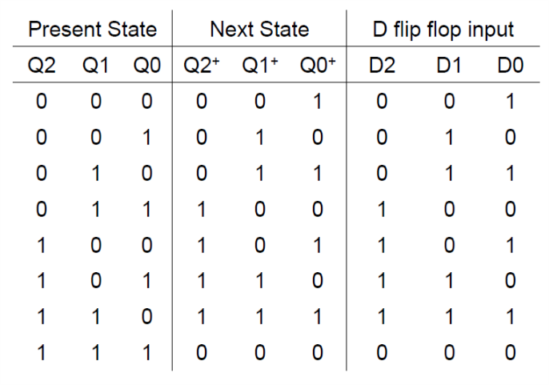

With the Present State as the D flip flop output.

Apply K-Map method:

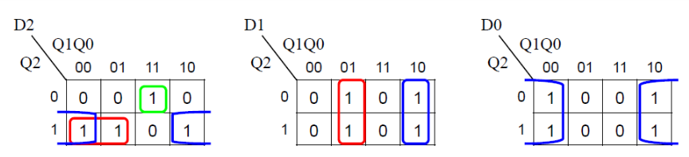

So we get $D_n = Q_n \oplus (Q_{n-1} \cdots Q_n)$

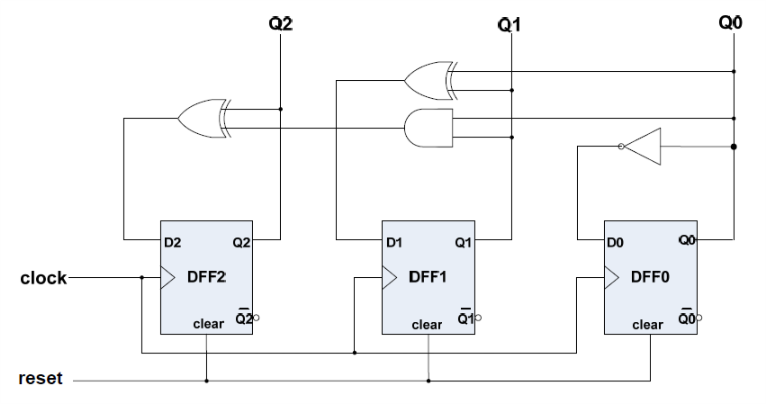

### External Control

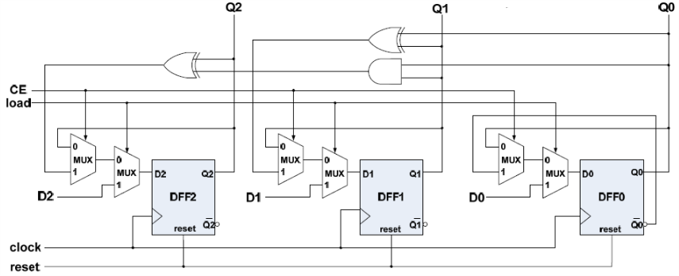

### Customize Counting Sequence

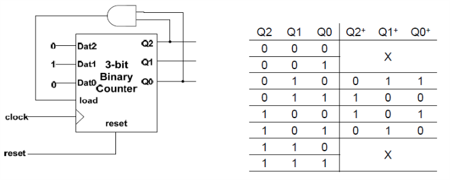

### Clock Divider

Divide by $n$, let the load is activated by $n-1$.

### Output Synchronization

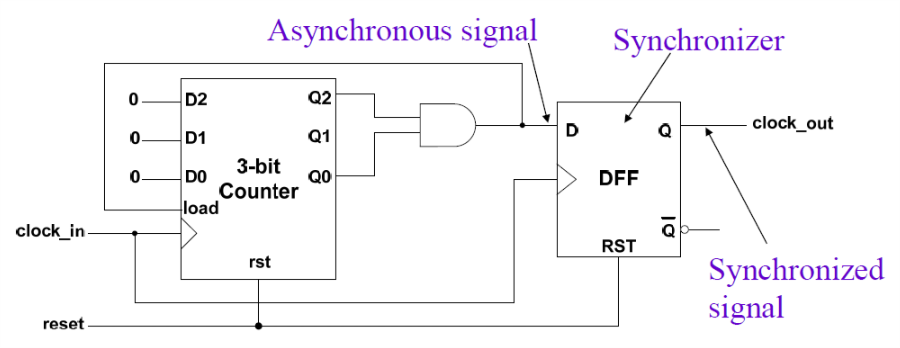

Since the output clock signal may have delay by the gate, so we give a D-Flip-Flop to synchronize the signal to the output.

The output still have delay, but the delay is smaller, not deleted.

### Up/Down Counter

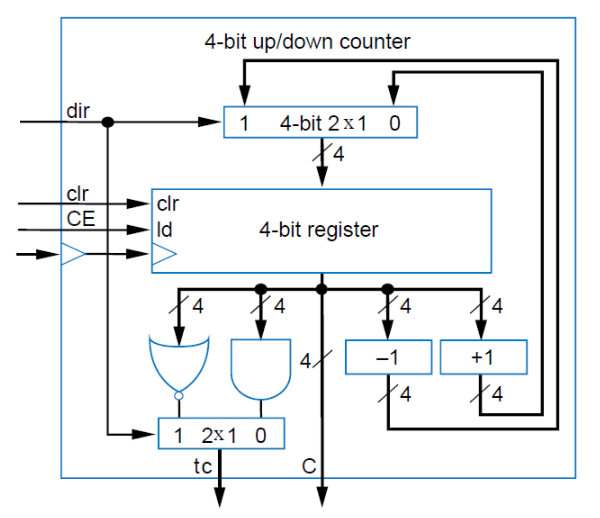

### Alternative Design Counter with Control

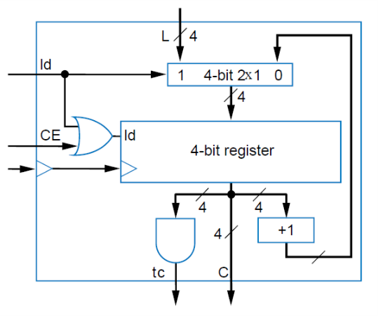

