# VE270 Lecture 9 Register and Shifter

## Registers

Store data, useful in data-paths.

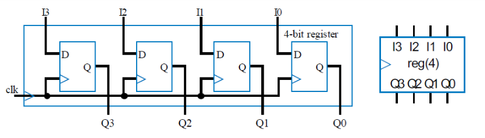

Then we add a mux to D-flipflop, to have a parallel load.

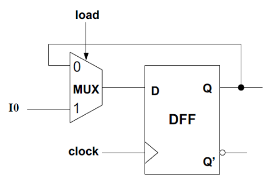

Then if there is too much register need to be controlled, we need to improve it.

The improvement is like that:

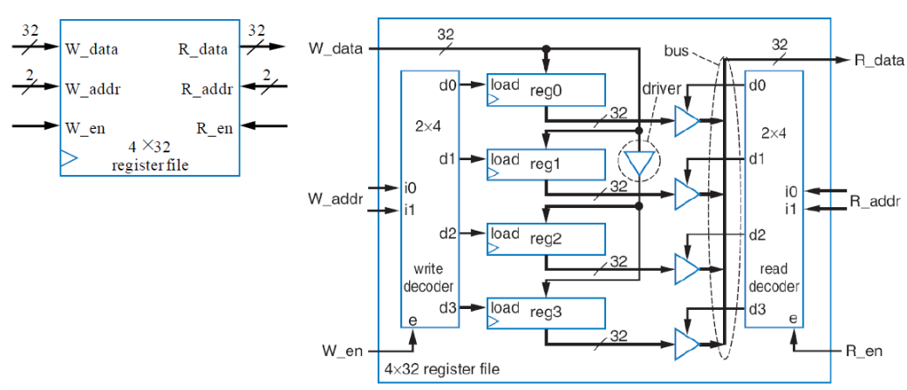

Thus we get the timing diagram as

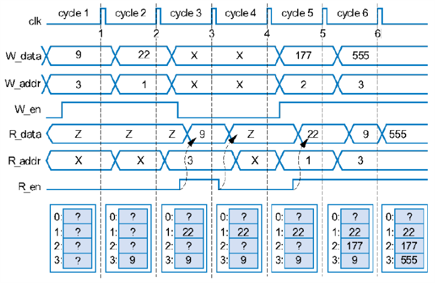

## Shift Register

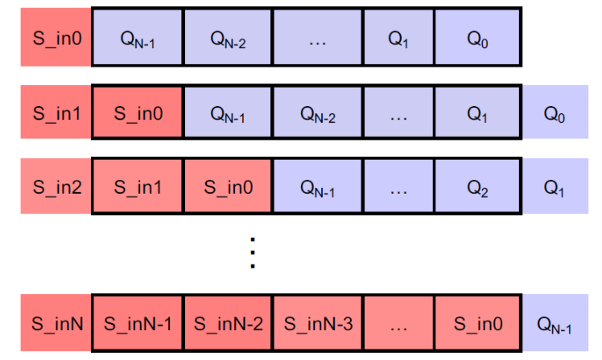

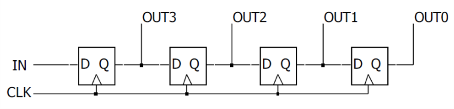

### Rotate Register

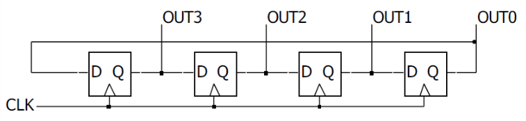

### Universal Shift Register

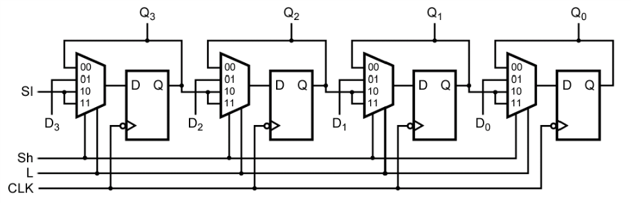

### Above-Mirror Display

| Pre-change                               | After-change                             |
| ---------------------------------------- | ---------------------------------------- |
| 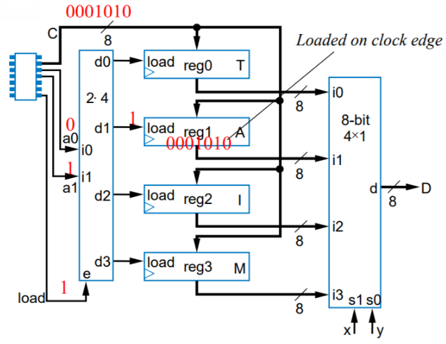 | 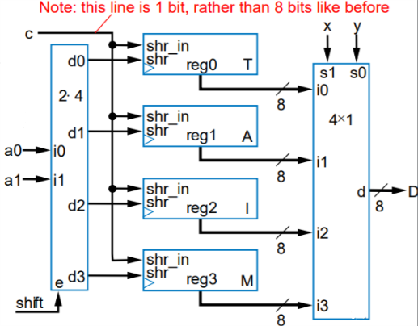 |

## Shifters

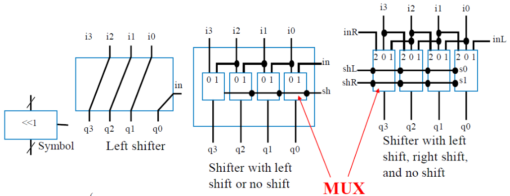

We can connect shifters together, $L2^n$ to $L1$ to derive a greater shifter from $0$ to $2^{n+1} - 1$ shift.