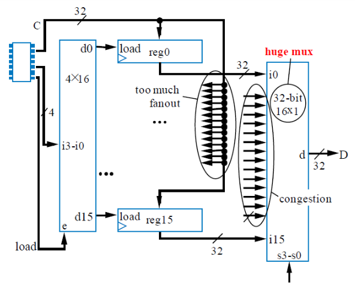

# VE270 Lecture 9 Register and Shifter

## Registers

Store data, useful in data-paths.

Then we add a mux to D-flipflop, to have a parallel load.

Then if there is too much register need to be controlled, we need to improve it.

The improvement is like that:

